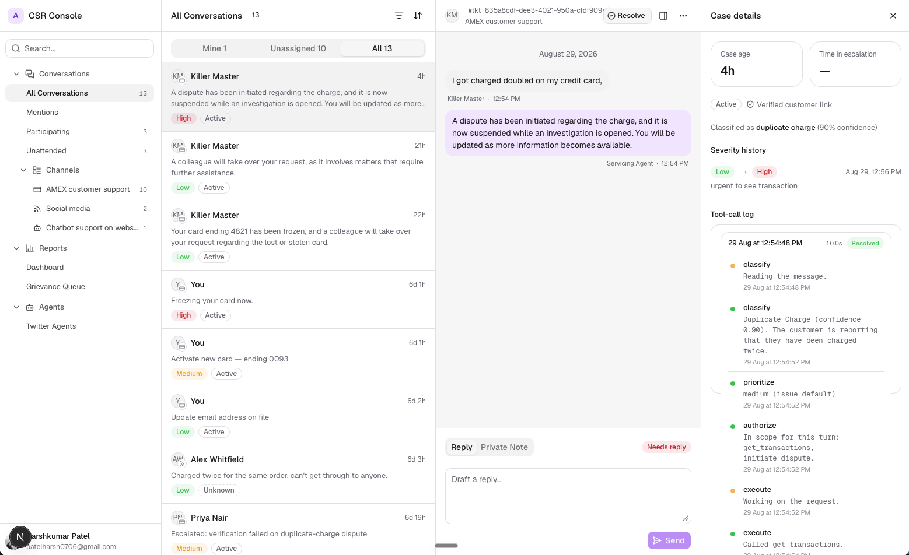
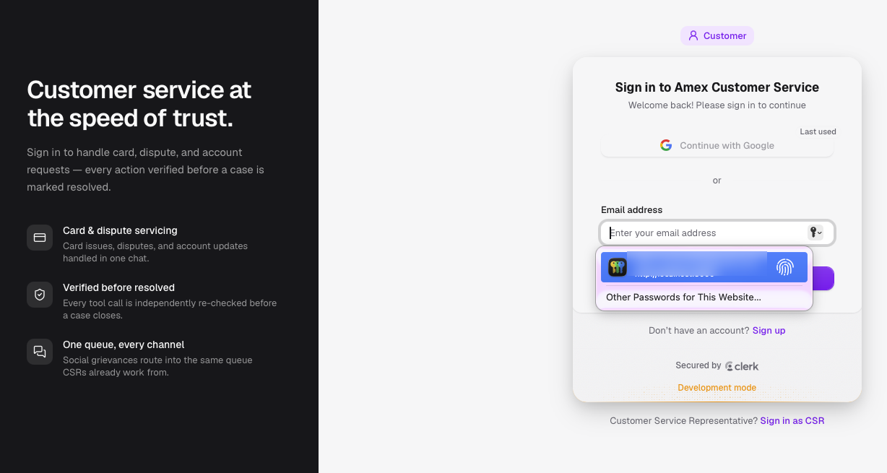
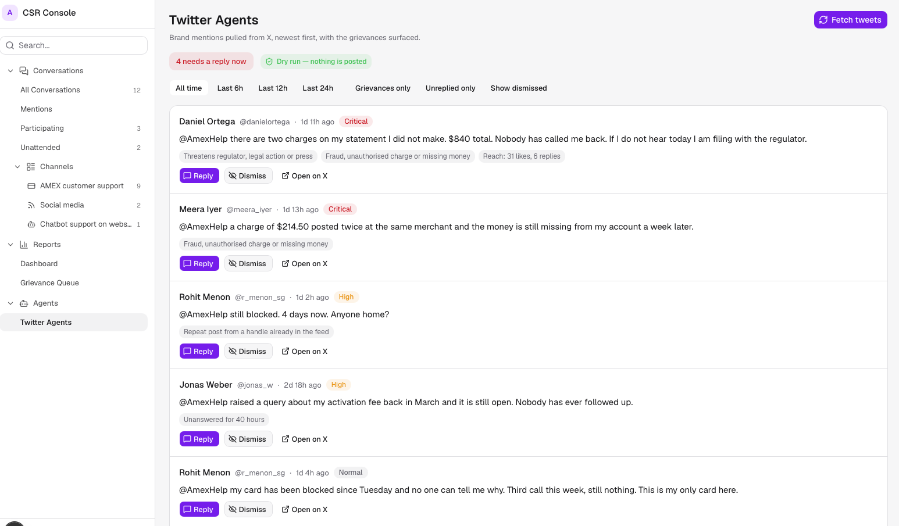

# Amex Customer Service Agent

An AI customer service agent built for the **American Express Innovation Labs
Hackathon (Singapore, 2026)**. A cardholder describes a problem in plain language;
the agent classifies it, sets a priority, runs the right servicing action, and
checks the result before the case is closed. Anything it cannot handle
confidently is escalated to a human Customer Service Representative (CSR).

Built with Next.js (App Router), the Vercel AI SDK, OpenAI, Clerk, SQLite, and
shadcn/ui.

## Screenshots

### CSR Console



The console CSRs work from. Conversations from every channel (chat, website
chatbot, social media) land in one inbox with their priority and status. Opening
a case shows the conversation, the classified issue and confidence, the severity
history, and a tool-call log of every step the agent took: classify, prioritize,
authorize, execute, and verify.

### Sign-in



Login is handled by **Clerk**, which acts as the authorization gate. Customers and
CSRs sign in through separate doors, and the admin console is restricted to
accounts with the CSR role.

### Twitter Agents



Brand mentions are pulled from X and ranked by urgency, so grievances such as
unauthorised charges or threats to go to a regulator surface first. CSRs can
reply, dismiss, or open the post on X. The screenshot uses sample fixture data
in dry-run mode, so nothing is posted.

## How it works

1. **Classify:** the LLM maps the request to one of the supported servicing
   issues and returns a confidence score. Low-confidence requests are escalated
   instead of acted on.
2. **Prioritize:** each issue has a default priority, which severity signals can
   raise but never lower.
3. **Authorize:** each intent may only call the tools declared in its scope.
4. **Execute:** the matching servicing tool runs (unblock card, initiate
   dispute, update profile, and so on).
5. **Verify:** system state is re-checked independently; the action tool is
   never its own witness. If verification fails, the case goes to a human CSR.

## Layout

| Path             | Contents                                                        |
| ---------------- | --------------------------------------------------------------- |
| `it-agent/`      | The Next.js application                                         |
| `context/`       | Specs: product overview, architecture, standards, UI, progress  |
| `feature-specs/` | Per-feature implementation specs                                |
| `docs/`          | Plans, runbooks, and screenshots                                |

`context/` is the source of truth for what to build and how. Read
`it-agent/AGENTS.md` first.

## Getting started

```bash
cd it-agent
npm install
npm run dev
```
