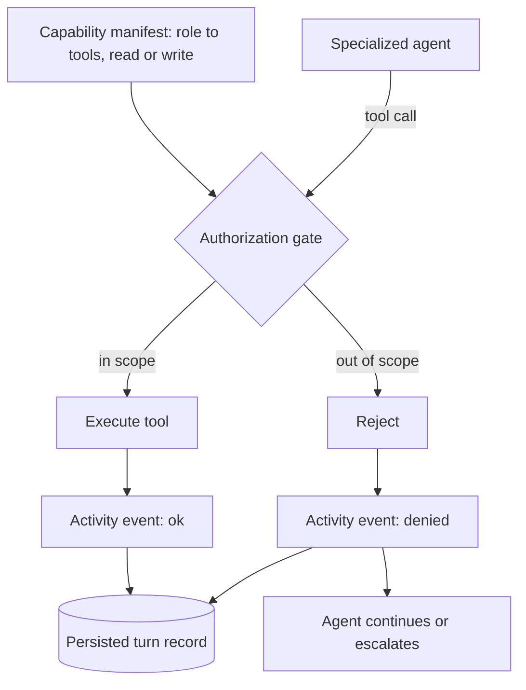

# Agent capability scoping and runtime authorization

## Summary

Give each of the three IT agents a declared set of tools it may call, and put a single authorization gate in front of every tool call that rejects and records anything outside that set. Least-privilege becomes something the demo shows rather than something the write-up claims.

---

## Problem Frame

The hackathon synopsis dated 2026-08-16 added a Responsible AI section that the project has no coverage for. It asks for scoped, single-purpose roles per agent, least-privilege enforcement, and an immutable chain of accountability across all AI interactions. Nothing in `docs/plans/2026-08-14-001-feat-agent-orchestration-pipeline-plan.md` addresses any of it — that plan predates the synopsis by two days.

The same synopsis expects agents to reach real ticketing, identity, and provisioning systems over secure APIs. The project deliberately does not do this: `context/project-overview.md` places real external IT systems out of scope and runs every tool against a mock database. That decision stands, which means the security posture cannot be evidenced by pointing at a real integration. It has to be evidenced by the agent architecture itself.

Two open-source ServiceNow MCP servers were evaluated as sources for that architecture. `echelon-ai-labs/servicenow-mcp` (MIT, 292 stars, 12 contributors) ships a declarative role-to-tools configuration that filters tools at registration and fails closed on invalid input. `aartiq/servicenow-mcp` (351 stars, TypeScript) defaults to read-only and requires opt-in flags for writes. Neither is adopted as a dependency; both are pattern sources.

---

## Key Decisions

**Borrow patterns, not code.** Neither ServiceNow server is vendored. `aartiq/servicenow-mcp` is licensed under Elastic License 2.0, which is source-available rather than open source and conflicts with the synopsis's Openness and Reusability claim. `echelon-ai-labs/servicenow-mcp` is MIT and serves as the reference implementation for the manifest pattern.

**A runtime gate, not a manifest alone.** Filtering tools at agent construction is cheaper but invisible — absence does not render, so a judge has to take the architecture diagram's word for it. A gate that rejects and logs makes the boundary observable in the Agent Activity panel and produces audit records as a side effect.

**The mock database stays.** Real system integration was considered and rejected. The backend is unbuilt, and a live external dependency is a demo-day risk the project cannot absorb. The consequence is that the synopsis's secure-toolchain language describes a simulation, and the write-up must say so.

**Verifiers are read-only by construction.** The orchestration plan already establishes that an action tool must never witness its own success. Classifying tools as read or write in the manifest, and permitting the verification stage to call only read tools, converts that from a discipline someone must remember into a property the gate enforces.

**Structured so a policy decision point stays a refactor.** The gate is a single choke point. Lifting authorization into a standalone policy module later is a move, not a redesign.

---

## Actors

- A1. Employee — the authenticated end user submitting a support request.
- A2. Specialized agent — one of the account unlock, password reset, or software access agents, each carrying its own declared tool scope.
- A3. Authorization gate — the single component every tool call passes through before execution.
- A4. Human IT support — the escalation target when an agent cannot resolve a request.

---

## Capability model

---

## Requirements

**Capability manifest**

- R1. Each agent has a declared set of tools it is permitted to call.
- R2. An agent is constructed with only the tools its declaration names, so out-of-scope tools are absent from its registry.
- R3. Each tool is classified in the declaration as read-only or mutating.
- R4. An unrecognized or malformed agent scope resolves to zero tools rather than to full access.

**Runtime enforcement**

- R5. Every tool call passes through a single authorization check before the tool executes.
- R6. A call naming a tool outside the calling agent's scope is rejected and never executed.
- R7. A rejection does not terminate the turn; the agent continues along a terminal path or escalates.
- R8. Tool arguments cannot widen an agent's scope.

**Verification integrity**

- R9. The verification stage may call only tools classified read-only.
- R10. A mutating tool invoked during verification is rejected by the same gate as any other out-of-scope call.

**Observability and audit**

- R11. A rejected call emits an activity event carrying a denied status.
- R12. A denial event records the calling agent, the attempted tool, the reason, and a timestamp.
- R13. Denial events persist with the turn so a completed session can be replayed after reload.
- R14. The Agent Activity panel can display the capability scope of the agent handling the current turn.

---

## Key Flows

- F1. In-scope execution
  - **Trigger:** An agent calls a tool its declaration names.
  - **Actors:** A2, A3
  - **Steps:** Gate resolves the calling agent's scope; tool is present; call executes; an ok event is emitted and persisted.
  - **Outcome:** Normal pipeline progression, unchanged from the existing design.
  - **Covered by:** R5, R11

- F2. Cross-boundary request
  - **Trigger:** An employee's message contains a second request belonging to a different agent, for example asking to unlock an account and reset a password in one sentence.
  - **Actors:** A1, A2, A3
  - **Steps:** Classification selects the higher-priority intent; that agent handles the turn; the model attempts the second request's tool; the gate rejects it; a denied event streams to the panel; the agent completes its own intent and routes or escalates the remainder.
  - **Outcome:** The in-scope request resolves, the out-of-scope one is visibly refused rather than silently executed.
  - **Covered by:** R6, R7, R11, R12

- F3. Verification integrity
  - **Trigger:** The pipeline reaches verification after a mutating tool has executed.
  - **Actors:** A2, A3
  - **Steps:** Verification calls the read-only checker matching the intent; the gate permits it; state is re-read independently of the action tool's return value.
  - **Outcome:** Verification reflects database state, not the action tool's self-report.
  - **Covered by:** R3, R9, R10

---

## Acceptance Examples

- AE1. Out-of-scope tool refused
  - **Covers R6, R7, R11.**
  - **Given:** The account unlock agent is handling a turn.
  - **When:** It attempts to call the password reset tool.
  - **Then:** The call does not execute, a denied event is emitted, and the turn continues to a terminal state.

- AE2. Fail-closed on bad scope
  - **Covers R4.**
  - **Given:** An agent is constructed with a scope name that does not match any declaration.
  - **When:** The agent starts a turn.
  - **Then:** It has no tools available and cannot execute any action.

- AE3. Mutating tool blocked during verification
  - **Covers R9, R10.**
  - **Given:** The pipeline has executed an unlock and reached verification.
  - **When:** A mutating tool is called during the verification stage.
  - **Then:** The gate rejects it and the verification stage fails rather than passing on a self-report.

- AE4. Argument tampering does not widen scope
  - **Covers R8.**
  - **Given:** The software access agent is handling a turn.
  - **When:** A tool call carries arguments naming another employee or another agent's capability.
  - **Then:** Scope resolution ignores the arguments and the call is evaluated against the calling agent's declaration only.

- AE5. Denial survives reload
  - **Covers R13.**
  - **Given:** A completed turn produced at least one denial.
  - **When:** The session is reloaded.
  - **Then:** The denial appears in the replayed activity history.

---

## Success Criteria

- A cross-boundary request phrased as ordinary employee language produces a visible denial during a live demo, without the scenario being contrived as an attack.
- A prompt-injection attempt naming another employee and another agent's capability is refused, and the refusal is visible.
- A completed demo session yields a count of attempted calls, denied calls, and zero out-of-scope executions.
- The Responsible AI section of the submission can cite implemented behavior rather than intended behavior.

---

## Scope Boundaries

**Deferred for later**

- A standalone policy decision point holding authorization independently of agent code. The gate is designed as a single choke point so this remains a refactor.
- Capability declarations expressed per user role rather than per agent.

**Outside this work**

- Real ServiceNow integration, whether through a Personal Developer Instance or otherwise.
- Vendoring or depending on either evaluated ServiceNow MCP server.
- The content-filtering, topic-restriction, lexical-control, PII-redaction, and grounding-verification layers of the synopsis's Responsible AI architecture. This work covers policy orchestration and least-privilege only.
- Multi-channel request aggregation and the knowledge-base retrieval and write-back layers, which are separate gaps against the same synopsis.

---

## Dependencies and Assumptions

- Depends on the six tools and the pipeline orchestrator from units U4 and U6 of `docs/plans/2026-08-14-001-feat-agent-orchestration-pipeline-plan.md`. Neither exists yet; `it-agent/lib/` currently contains only `utils.ts`, and there is no `app/api/` directory.
- Assumes the three-agent split is implemented as one shared interface with three declarations rather than three duplicated pipelines.
- Assumes the activity event contract gains a denied status alongside running, ok, and failed. That contract is consumed by the deferred UI work, so the addition should land before the panel is built.
- Assumes tools continue to resolve the acting employee from the session rather than from model output, per the existing trust boundary.

---

## Outstanding Questions

**Resolve before planning**

- The runtime platform is unsettled. The synopsis names Alibaba Cloud, the AgentTeams framework, and Qwen models, while `context/architecture.md` specifies Next.js, the Vercel AI SDK, and Turso. The synopsis contradicts itself further by describing its Responsible AI controls in AWS terms. The manifest and gate are platform-agnostic in principle, but the surrounding code is not.

**Deferred to planning**

- Whether a denial is surfaced to the employee in chat or only in the activity panel.
- Whether an agent that hits a denial should attempt a handoff to the correct agent within the same turn or escalate.
- Whether capability scope is displayed continuously in the panel or only on demand.

---

## Sources and Research

- `docs/plans/2026-08-14-001-feat-agent-orchestration-pipeline-plan.md` — the eight implementation units this work depends on, the activity event contract, and the existing verification-independence decision.
- `context/architecture.md` — stack, system boundaries, and the four current invariants.
- `context/project-overview.md` — the three intents, the six tools, and the mock-database scope decision at line 56.
- `echelon-ai-labs/servicenow-mcp` (MIT) — `config/tool_packages.yaml` demonstrates role-to-tools declarations; `src/servicenow_mcp/server.py` resolves the active package at startup, filters tools at registration, and falls back to an empty package on invalid input.
- `aartiq/servicenow-mcp` (Elastic License 2.0) — read-only default with opt-in write flags. Pattern reference only; the license precludes reuse here.
