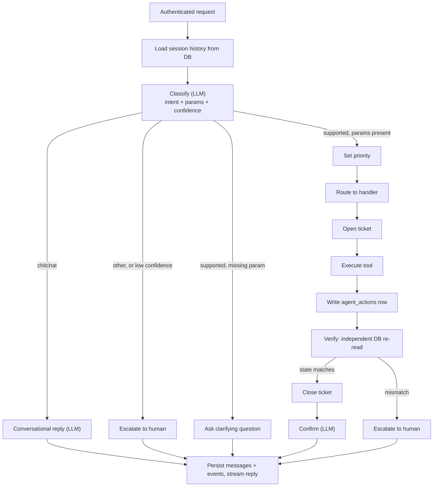
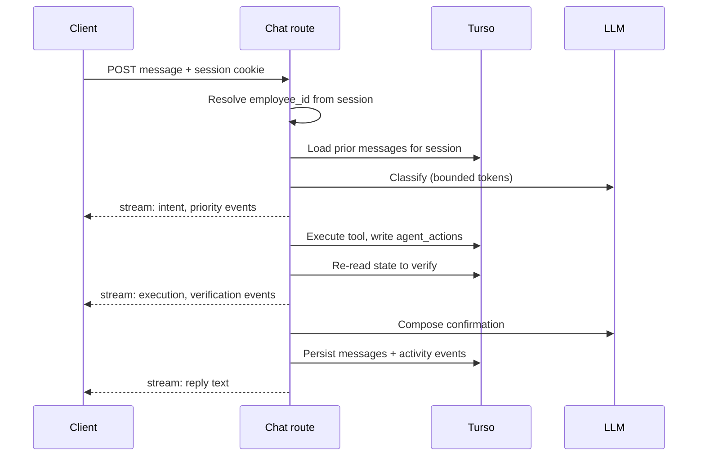

# feat: Agent orchestration pipeline and data layer

Paths in this plan are relative to the project root. Application code lives under `it-agent/`; specs live under `context/`.

## Summary

Build the backend spine of the IT Service Chat Agent: the Turso data layer, Auth.js session boundary, six IT tools, and a deterministic six-stage orchestration pipeline exposed through one streaming chat route. The LLM runs only at the edges — classifying the request and writing the final confirmation. Chat UI and the Agent Activity panel are deferred to a follow-up plan, but this plan fixes the contracts they will consume.

## Problem Frame

`it-agent/` is a bare Next.js 16.3 scaffold with no data layer, auth, or agent code. The specs in `context/architecture.md` and `context/project-overview.md` define an eight-step agent flow and six tools, but three contracts remain unresolved and every downstream component depends on them: what the classifier returns, what an activity event looks like, and when a ticket exists. Building UI before these are settled would force a rewrite of both sides.

---

## Requirements

**Agent pipeline**

- R1. A request is classified into exactly one of `password_reset`, `account_unlock`, `software_access`, `chitchat`, or `other`.
- R2. Classification returns required tool parameters and a confidence score in the same model call.
- R3. A supported intent missing a required parameter yields a clarifying question instead of a tool call.
- R4. Priority, routing, execution, and verification run as deterministic code with no model involvement.
- R5. An `other` intent or a failed verification escalates to human support.
- R6. A `chitchat` intent returns a conversational reply without entering the tool pipeline.

**Data and persistence**

- R7. All six tables live in Turso and are reachable only through Drizzle.
- R8. Conversation history is reloaded from the database on every request; no request-spanning state is held in module scope.
- R9. A ticket is created for every classified support request and closed when verification passes.
- R10. Every executed tool call is written to `agent_actions` at execution time, before the reply is composed.

**Auth and trust boundary**

- R11. Employees authenticate through Auth.js Credentials checked against the `employees` table.
- R12. `employee_id` is read from the authenticated session on every tool call, never from the request body or model output.
- R13. An unauthenticated chat request is rejected before any pipeline stage runs.

**Observability and KPIs**

- R14. Each pipeline stage emits a typed activity event carrying stage, status, and detail.
- R15. Activity events persist so a completed turn can be re-rendered after a page reload.
- R16. Resolution outcome and a CSAT rating are recordable per chat session.

---

## Key Technical Decisions

- **Deterministic pipeline, model at the edges.** Only classification and confirmation call the LLM. Routing and verification are code, which bounds latency, removes live improvisation during a demo, and makes the pipeline unit-testable without mocking a model.

- **Classification returns intent, parameters, and confidence in one structured call.** Tools need arguments (`software` for access requests) that a bare intent label cannot supply. Extracting them in the same call avoids a second round-trip and keeps the turn inside two model calls total.

- **Low confidence or a missing parameter routes to clarification, not escalation.** Treating "I need software access" as unresolvable would escalate a request the agent can handle after one question. Clarification is a seventh terminal state, not a seventh stage.

- **`chitchat` is a first-class intent.** Without it, "thanks" classifies as `other` and triggers a false escalation mid-demo.

- **Ticket per request, closed on verified resolution.** Makes the resolution-rate KPI a direct query over `tickets` rather than a derived guess, and gives escalations a durable handle.

- **Verification re-reads the database through a separate tool.** Trusting an action tool's own return value would make verification pass unconditionally. `check_account_status` and `check_software_access` are the verifiers; the action tools are never their own witness.

- **Activity events are persisted, not only streamed.** A reload mid-demo would otherwise leave the panel blank while chat history reloads.

- **Turso for both local and deployed environments.** A local SQLite file cannot survive Vercel's ephemeral filesystem, and running a file locally against Turso in production would create a dev/prod split. One connection string shape for both removes that class of surprise.

- **Auth.js route protection uses `proxy.ts`, not `middleware.ts`.** Next.js 16 deprecated the `middleware` file convention and renamed it to `proxy`; most Auth.js documentation still shows `middleware.ts`.

---

## High-Level Technical Design

Pipeline stages and their terminal states:



Per-turn lifecycle, showing where state lives:



Activity event contract consumed by the future panel:

```ts
type ActivityEvent = {
  stage: 'classify' | 'priority' | 'route' | 'execute' | 'verify' | 'confirm'
  status: 'running' | 'ok' | 'failed'
  label: string          // human-readable, panel-ready
  detail?: unknown       // tool args/results, redacted of secrets
  at: string             // ISO timestamp
}
```

---

## Implementation Units

### U1. Dependencies and environment scaffolding

- **Goal:** Install the stack and fail fast on missing configuration.
- **Requirements:** Enables all.
- **Dependencies:** None.
- **Files:** `it-agent/package.json`, `it-agent/.env.example`, `it-agent/lib/env.ts`, `it-agent/vitest.config.ts`
- **Approach:** Add `ai`, the Google provider for the AI SDK, `drizzle-orm`, `@libsql/client`, `drizzle-kit`, `next-auth`, `zod`, and `vitest`. Parse and validate all environment variables through one module so a missing `TURSO_AUTH_TOKEN`, `AUTH_SECRET`, or model key surfaces at startup rather than mid-request.
- **Test scenarios:** Env parser throws a named error when a required variable is absent; parser returns typed values when all are present.
- **Verification:** `npm run build` passes; importing `lib/env` with an incomplete `.env` fails with a readable message.

### U2. Data layer: schema, client, and seed

- **Goal:** Model the six tables in Drizzle, connect to Turso, and seed demo-ready data.
- **Requirements:** R7, R9, R10, R15, R16
- **Dependencies:** U1
- **Files:** `it-agent/lib/db/schema.ts`, `it-agent/lib/db/client.ts`, `it-agent/lib/db/seed.ts`, `it-agent/drizzle.config.ts`, `it-agent/tests/schema.test.ts`
- **Approach:** Tables `employees`, `tickets`, `agent_actions`, `software_access`, `chat_sessions`, `chat_messages`. Status fields use explicit string unions, not free text: ticket status `open | resolved | escalated`; account status carries a locked flag and a password-reset marker; software access `none | pending | granted`. `agent_actions` links to both the chat message and the ticket so a turn can be replayed and a ticket audited. Activity events persist as a JSON column on `chat_messages`, keeping the panel's replay source next to the message it describes. Seed data must cover the full demo script: one locked account, one unlocked, one employee with Figma already granted, one without.
- **Patterns to follow:** Boundary rule in `context/architecture.md` — only `lib/db/` touches the database.
- **Test scenarios:** Seed script populates all six tables and is safe to re-run; a ticket row rejects a status outside the union; querying an employee returns typed fields with no `any`.
- **Verification:** Migrations apply against a Turso database; seeded rows are readable through Drizzle.

### U3. Authentication and the session trust boundary

- **Goal:** Sign employees in and expose one server-side helper that resolves the authenticated `employee_id`.
- **Requirements:** R11, R12, R13
- **Dependencies:** U2
- **Files:** `it-agent/auth.ts`, `it-agent/app/api/auth/[...nextauth]/route.ts`, `it-agent/proxy.ts`, `it-agent/lib/auth/session.ts`, `it-agent/tests/session.test.ts`
- **Approach:** Auth.js Credentials provider validates against `employees` and issues a JWT session carrying `employee_id`. `lib/auth/session.ts` exports the single accessor every tool and route uses; nothing else reads the session directly. Route protection lives in `proxy.ts` — Next.js 16 deprecated `middleware.ts` and renamed the convention.
- **Test scenarios:** Valid credentials produce a session containing the employee id; invalid credentials return an error without a session; the session helper throws on an unauthenticated call rather than returning a null id that a caller might pass onward.
- **Verification:** Signing in sets a session cookie; requesting the chat route without one is rejected.

### U4. The six IT tools

> **SUPERSEDED (2026-08-28) — do not build from this unit as written.** The
> tools below are the pre-pivot IT-helpdesk set (`employee_id`,
> `reset_password`, `unlock_account`, `software_access`). The product moved to
> Amex servicing on 2026-08-22: six issues across Card Servicing, Transaction &
> Dispute, and Account & Profile. The *shape* of U4–U7 carries forward and was
> followed; the tool list did not. See `feature-specs/10-llm-integration.md`
> for what was actually built, and note that `employee_id` there is
> `customer_id`, resolved identically from the session.

- **Goal:** Implement the six tools so each derives its actor from the session.
- **Requirements:** R10, R12
- **Dependencies:** U2, U3
- **Files:** `it-agent/lib/tools/index.ts`, `it-agent/lib/tools/employee.ts`, `it-agent/lib/tools/account.ts`, `it-agent/lib/tools/software.ts`, `it-agent/tests/tools.test.ts`
- **Approach:** `get_employee`, `check_account_status`, `reset_password`, `unlock_account`, `check_software_access`, `request_software_access`. No tool accepts `employee_id` as a caller-supplied argument — each resolves it through the session helper from U3, so a model-produced id cannot reach a mutation. Mutating tools write their `agent_actions` row inside the same call that performs the write.
- **Execution note:** Write the trust-boundary tests first; they are the security contract this unit exists to hold.
- **Test scenarios:** A mutating tool called with a foreign employee id in its arguments still acts only on the session's employee; `reset_password` writes an `agent_actions` row before returning; `check_software_access` returns `none` for an ungranted product; each mutating tool leaves the database in the state its verifier expects.
- **Verification:** Tool tests pass against seeded data; no tool signature exposes `employee_id`.

### U5. Classification stage

- **Goal:** Turn free text into a typed intent with parameters and confidence in one model call.
- **Requirements:** R1, R2, R3, R6
- **Dependencies:** U1
- **Files:** `it-agent/lib/agent/classify.ts`, `it-agent/lib/agent/intents.ts`, `it-agent/tests/classify.test.ts`
- **Approach:** A Zod schema defines the classifier output (`intent`, optional `software`, `confidence`); the AI SDK's structured-output generation enforces it. Prompt and token ceiling stay small — the call returns a label and at most one parameter. Confidence below the threshold maps to `other`. Recent history from U7 is passed in so a follow-up answer to a clarifying question resolves against the pending intent instead of being classified from scratch.
- **Test scenarios:** "I forgot my password" yields `password_reset`; "I need Figma access" yields `software_access` with `software: "Figma"`; "I need software access" yields the intent with no `software`, which the pipeline treats as clarification-required; "thanks!" yields `chitchat`; "my monitor is broken" yields `other`; a below-threshold result maps to `other`.
- **Verification:** Classifier tests pass with a stubbed model; malformed model output fails schema validation rather than propagating.

### U6. Pipeline orchestrator

- **Goal:** Run the six stages and their terminal states, emitting a typed event per stage.
- **Requirements:** R4, R5, R9, R14
- **Dependencies:** U4, U5
- **Files:** `it-agent/lib/agent/pipeline.ts`, `it-agent/lib/agent/events.ts`, `it-agent/lib/agent/priority.ts`, `it-agent/tests/pipeline.test.ts`
- **Approach:** The orchestrator takes a classification result and the session employee, then walks priority, routing, execution, and verification as plain code. Priority orders `account_unlock` above `password_reset` above `software_access`. Verification calls the read tool matching the intent and compares against the expected post-state; a mismatch escalates. Each stage emits an `ActivityEvent` through a callback so the route can stream and persist the same objects. Every stage is wrapped so a thrown error emits a `failed` event and escalates rather than terminating the stream silently.
- **Test scenarios:** A successful unlock produces six ordered events ending in `confirm`/`ok` and closes the ticket; a verification mismatch produces a `verify`/`failed` event, escalates, and leaves the ticket `escalated`; `other` escalates without executing a tool; a tool that throws emits `execute`/`failed` and escalates; concurrent pipeline runs for two employees do not observe each other's events.
- **Verification:** Pipeline tests pass with stubbed tools; no stage calls the model except classification and confirmation.

### U7. Chat route with streaming and stateless history

- **Goal:** Expose the pipeline as one authenticated streaming endpoint that holds no state between requests.
- **Requirements:** R8, R13, R14, R15
- **Dependencies:** U3, U6
- **Files:** `it-agent/app/api/chat/route.ts`, `it-agent/lib/db/queries.ts`, `it-agent/tests/chat-route.test.ts`
- **Approach:** Resolve the session first and reject unauthenticated requests before any other work. Load prior messages for the session from Turso on every request — no module-scope cache. Stream activity events as they are emitted, then the confirmation text. Persist the user message, the reply, and the turn's activity events before the response completes. Export `maxDuration = 60`, which Next.js 16 still honors as a route segment config.
- **Execution note:** Add the statelessness test before the route logic; it is the property the serverless deployment depends on.
- **Test scenarios:** An unauthenticated POST is rejected before the classifier runs; two sequential requests on the same session see prior history reloaded from the database; module state is not reused across requests (a second request with a different session never observes the first session's history); activity events reach the client before the reply text; a mid-pipeline failure still emits a terminal event and persists the turn.
- **Verification:** A signed-in request completes all three intents end to end with the database reflecting each change; reloading a session returns the persisted events.

### U8. Resolution outcome and CSAT capture

- **Goal:** Record the KPI inputs the brief's success criteria require.
- **Requirements:** R16
- **Dependencies:** U2, U7
- **Files:** `it-agent/app/api/feedback/route.ts`, `it-agent/lib/db/queries.ts`, `it-agent/tests/feedback.test.ts`
- **Approach:** An authenticated endpoint records a 1–5 CSAT rating against a chat session. Resolution outcome is already implied by ticket status from U6, so this unit adds only the satisfaction input and the queries that compute resolution rate from `tickets`. The rating widget itself belongs to the UI plan.
- **Test scenarios:** A rating outside 1–5 is rejected; a rating for another employee's session is rejected; the resolution-rate query counts resolved tickets against total tickets.
- **Verification:** Ratings persist and are readable per session.

---

## Scope Boundaries

**In scope:** data layer, auth, six tools, classification, pipeline, streaming chat route, KPI capture endpoint.

**Deferred to follow-up work**

- Chat UI and the Agent Activity panel. This plan fixes the event contract they consume so the UI plan can be built against it without rework.
- The CSAT rating widget, which pairs with the endpoint from U8.
- Deployment configuration and environment setup on Vercel.

**Outside this prototype**

- Real external IT systems; all tools operate on seeded data.
- Background job processing and real-time collaboration, per `context/project-overview.md`.

---

## System-Wide Impact

The session trust boundary from U3 is depended on by every tool and the chat route; changing how `employee_id` is resolved would touch all of U4, U6, and U7 at once. The `ActivityEvent` shape is a published contract — the deferred UI plan and the persisted replay data both read it, so changes after U7 lands require a data migration.

---

## Risks and Dependencies

- **Next.js 16 differs from most published guidance.** `it-agent/AGENTS.md` states this directly, and the `middleware` to `proxy` rename already confirms it. Consult `it-agent/node_modules/next/dist/docs/` before writing route, auth, or config code rather than relying on tutorials.
- **Turso must be provisioned before U2.** Migrations run against a real database; there is no local-file fallback in this design.
- **Gemini free-tier rate limits surface during rapid iteration**, not under demo concurrency. The AI SDK provider swap is a one-line change if a different key becomes available.
- **Structured-output support varies by model.** If the classifier's schema enforcement proves unreliable on the chosen model, the fallback is a constrained enum-only prompt plus a parameter-extraction pass, which costs a second call and pressures the timeout budget in U7.

---

## Open Questions

- Does an escalated request need a notification path, or is an `escalated` ticket plus an in-chat message sufficient for the demo?
- Should a follow-up message on a resolved session open a new ticket or reopen the prior one?

---

## Sources and Research

- `context/architecture.md` — stack, system boundaries, invariants, storage model.
- `context/project-overview.md` — eight-step flow, three intents, six tools, success criteria.
- `it-agent/AGENTS.md` — Next.js 16 breaking-change warning and the local docs path.
- `it-agent/node_modules/next/dist/docs/01-app/03-api-reference/03-file-conventions/middleware.md` — `middleware` deprecated, renamed to `proxy` in Next.js 16.
- `it-agent/node_modules/next/dist/docs/01-app/03-api-reference/03-file-conventions/02-route-segment-config/maxDuration.md` — `maxDuration` remains a valid route segment export.
- `it-agent/package.json` — Next.js 16.3.0, React 19.2.8, Tailwind v4; no agent, data, or auth dependencies installed yet.
