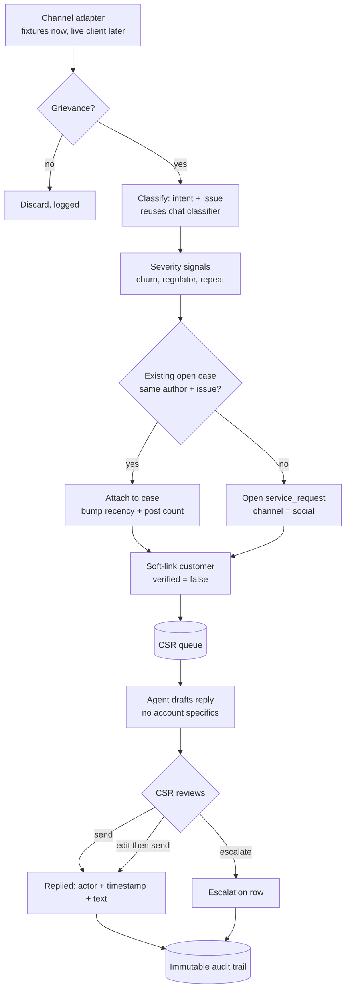

# feat: Social grievance intake and CSR resolution console

Paths are relative to the project root. Application code lives under `it-agent/`; specs live under `context/`.

## Summary

Sweep public social channels (X, to start) for customer grievances, classify and deduplicate them into the same service-request pipeline the chat agent already uses, and put each one in front of a human CSR with a drafted reply and a visible replied/not-replied state. The agent triages, prioritises, and drafts. **A human sends — there is no auto-send path.** A console shows, per case, how long the grievance has existed, how long it has been escalated, whether the customer is still active, and which CSR (if any) has contacted them. A dashboard rolls that up across all open grievances. This closes step (1) of all three intents in the hackathon synopsis — multi-channel request aggregation — without ever letting an unauthenticated channel drive a servicing action.

---

## Problem Frame

Customers post grievances publicly and issuers cannot answer all of them. A real example observed on 2026-08-21: a cardholder publicly tagged an Amex regional account reporting a query **pending since May 2025**, announced they had closed their card, and told others not to use the product. The same grievance appeared twice within sixteen hours as the customer re-posted.

Three failures are visible in that single case, and all three are addressable:

1. **No intake.** The complaint arrived on a channel with no route into the servicing queue.
2. **No dedupe.** One person, one issue, two posts, and nothing links them.
3. **No aging signal.** Fifteen months elapsed with no escalation trigger.

The existing chat pipeline (`docs/plans/2026-08-14-001-feat-agent-orchestration-pipeline-plan.md`) already classifies intent, assigns priority, executes tools, verifies, and escalates. It is reachable only by an authenticated user typing into a chat box. This work adds a second front door and a human workbench behind it, reusing that pipeline rather than duplicating it.

---

## Requirements

**Intake and classification**

- R1. Public posts are ingested through a channel adapter, one implementation per channel.
- R2. Each post is classified as grievance or not-grievance before any further processing.
- R3. A grievance is classified into an intent and issue from the existing taxonomy, or marked `other` for human triage.
- R4. Priority is assigned from the issue's default, and may be escalated by severity signals but never lowered.
- R5. A post that names no resolvable customer is still queued, flagged as unidentified.

**Deduplication and case linking**

- R6. Repeat posts from the same author about the same issue within a window attach to the existing case rather than opening a new one.
- R7. A grievance already open on another channel attaches to that case.
- R8. Attaching a duplicate raises the case's post count and recency, never its priority by itself.

**Servicing boundary**

- R9. A social identity is a **hint**, never an authentication. Cases carry a `verified: false` link to a customer record.
- R10. No servicing tool executes on the authority of a social post. Execution requires an authenticated session.
- R11. The agent never publishes. Outbound replies are drafted and require an explicit human send.

**CSR console**

- R12. A queue lists open grievances ordered by priority, then age.
- R13. Each case shows the original post, the classification, the dedupe history, and the linked customer if any.
- R14. Each case shows an unambiguous reply state: `needs reply`, `draft ready`, `replied`, or `escalated`.
- R15. Sending a reply records who sent it, when, and the text sent.
- R16. Case age is displayed prominently and drives queue ordering within a priority band.

**Case state a CSR must be able to read at a glance**

- R19. Severity is a **current** level, not a fixed assignment. It may be raised after the case opens, and every change records the previous level, the new level, the trigger, and the timestamp.
- R20. A case carries **two independent clocks**: age since the first post, and time-in-escalation since it was escalated. Time-in-escalation is null until escalation and does not reset on reply.
- R21. A case shows **customer retention status** — `active`, `closed`, or `unknown` — resolved from the linked customer record. `unknown` is correct and expected for an unidentified case; it is never guessed.
- R22. Contact state names the **specific CSR** who replied, not just that a reply happened. An unanswered case shows no name rather than a placeholder.

**Dashboard**

- R23. An aggregate view reports open grievances by severity, the oldest unanswered case, escalations past their threshold, and **customers who closed their account while a grievance was open**.
- R24. Every dashboard figure is derived by query from case and audit rows. No counter is incremented in application code.

**Audit**

- R17. Every state transition writes an immutable record: ingested, classified, deduped, drafted, sent, escalated, closed, severity-changed.
- R18. A drafted reply that a human edits before sending records both versions.

---

## Key Technical Decisions

- **Ingest is an adapter interface; the demo runs on fixtures.** A live social API on stage is a dependency that can fail in front of judges, and X API access is priced beyond a prototype. `SocialChannelAdapter` has one fixture implementation seeded with realistic grievance text and one stub for a live client. The pipeline cannot tell the difference.

- **Social identity is a hint, never an authentication.** This is the load-bearing decision. A handle is not a cardholder, so a case links to a customer with `verified: false` and that flag gates everything downstream. It preserves invariant 1 (`customer_id` comes from the authenticated session) unchanged, and it is the honest answer to "what stops someone tweeting as me?"

- **The agent drafts; a human sends.** Auto-replying publicly to an angry customer is the highest-risk surface in the product. The CFPB's 2023 Issue Spotlight documents chatbots trapping customers in loops and refusing escalation — auto-reply would rebuild the documented failure. Human-send is also what every real issuer does.

- **Public acknowledgement, secure-channel resolution.** Replies acknowledge and hand off to an authenticated channel. Account specifics are never discussed publicly, so the reply drafter is constrained to non-account language by construction rather than by prompt discipline.

- **Social cases become ordinary service requests.** One pipeline, one audit trail, one set of KPI queries. A parallel social-only system would fork the data model and double the work.

- **Dedup keys on author plus issue within a window, not on text similarity.** The observed case is a near-verbatim re-post, but paraphrases are common. Author-plus-issue is cheap, explainable to a judge, and correct for the dominant case.

- **Age is a first-class ranking signal.** A fifteen-month-old case outranks a fresh one at equal priority. Without this the queue reproduces the failure it exists to fix.

- **Two clocks, not one.** Case age and time-in-escalation answer different questions and must not be collapsed. A case can be young but stuck in escalation for days, or old but only just escalated. Collapsing them hides whichever failure is actually happening, and "how long has it been escalated" is unanswerable from a single timestamp.

- **Retention status is displayed, never inferred.** `active`, `closed`, or `unknown`, read from the customer record. An unidentified social case is `unknown`, and that is a truthful answer rather than a gap. Guessing retention from tone ("sounds like they left") would put a fabricated business fact in front of a CSR.

- **Customers lost while a grievance was open is the headline metric.** It is the only figure that prices the problem in money rather than minutes, and the observed case supplies it directly: a query pending since May 2025, a card closed, announced publicly. Everything else on the dashboard is operational; this one is the argument.

---

## High-Level Technical Design

The servicing boundary, stated as a rule the code enforces: **everything left of `QUEUE` is triage and may act on untrusted input; nothing right of it may execute a servicing tool without an authenticated session.**

---

## Implementation Units

### S1. Channel adapter and fixture corpus

- **Goal:** One interface for social intake, with a fixture implementation that makes the demo deterministic.
- **Requirements:** R1
- **Dependencies:** Data layer (U2 of the orchestration plan)
- **Files:** `it-agent/lib/channels/adapter.ts`, `it-agent/lib/channels/fixtures.ts`, `it-agent/lib/channels/fixtures/social-posts.json`, `it-agent/tests/channels.test.ts`
- **Approach:** `SocialChannelAdapter` exposes `fetchSince(timestamp)` returning normalised posts (`channel`, `external_id`, `author_handle`, `text`, `posted_at`, `permalink`). The fixture corpus must include: a clear card-unblock grievance, a duplicate re-post from the same author, an aged case, a non-grievance brand mention, and a post naming no resolvable customer. Anonymise handles — do not ship a real individual's grievance in the repo.
- **Test scenarios:** `fetchSince` returns only posts after the timestamp; a malformed fixture row fails loudly rather than yielding a partial post; the non-grievance mention is present so S2 has a negative case.
- **Verification:** Adapter returns the fixture corpus with stable ordering across runs.

### S2. Grievance detection and classification

- **Goal:** Decide whether a post is a grievance, then reuse the existing classifier for intent and issue.
- **Requirements:** R2, R3, R4
- **Dependencies:** S1, classification stage (U5)
- **Files:** `it-agent/lib/social/triage.ts`, `it-agent/lib/social/severity.ts`, `it-agent/tests/social-triage.test.ts`
- **Approach:** A grievance gate runs first and cheaply — a brand mention that is praise or unrelated must not enter the pipeline. Grievances then pass to the existing intent/issue classifier unchanged; a social post is just another input string. Severity signals (stated account closure, threat to contact a regulator, repeat posting) may raise priority one band, never lower it.
- **Execution note:** Write the negative cases first. False positives here waste CSR time, which is the thing the product claims to save.
- **Test scenarios:** Praise mentioning the brand is not a grievance; a card-unblock complaint yields `card_servicing` / `card_unblock` at High; "I closed my card" raises priority one band; an unclassifiable grievance yields `other` and still queues.
- **Verification:** Fixture corpus classifies with no false positives on the non-grievance case.

### S3. Deduplication and case linking

- **Goal:** One grievance, one case, however many times it is posted.
- **Requirements:** R6, R7, R8
- **Dependencies:** S2
- **Files:** `it-agent/lib/social/dedupe.ts`, `it-agent/lib/db/queries.ts`, `it-agent/tests/social-dedupe.test.ts`
- **Approach:** Look up an open case keyed on author handle plus issue within a configurable window. On a hit, attach the post and update recency and post count. Priority is not raised by duplication alone — repetition is a recency signal, not a severity one, and conflating them lets a spammer jump the queue.
- **Test scenarios:** The same author re-posting the same issue attaches rather than opening a second case; the same author posting a *different* issue opens a new case; a post outside the window opens a new case; attaching leaves priority unchanged; a grievance already open from chat attaches to that case.
- **Verification:** The duplicate pair in the fixture corpus produces exactly one case with two attached posts.

### S4. Social case to service request bridge

- **Goal:** Social grievances become ordinary service requests, carrying the fields the console and dashboard need to answer age, escalation duration, retention, and contact state without guessing.
- **Requirements:** R5, R9, R10, R17, R19, R20, R21, R22
- **Dependencies:** S3
- **Files:** `it-agent/lib/db/schema.ts`, `it-agent/lib/social/case.ts`, `it-agent/lib/social/severity.ts`, `it-agent/tests/social-case.test.ts`
- **Approach:** Add `channel` and a `social_post` table linked to `service_request`. `service_request` gains `current_severity` (mutable, distinct from the priority it was opened with), `escalated_at` (nullable — set once, on first escalation, never cleared or reset by a later reply), and `replied_by` / `replied_at` (nullable, the CSR's `employee_id` and timestamp). A `severity_change` table logs every transition: previous level, new level, trigger, timestamp — R19's audit requirement, not just its current value. Case age is *always* derived (`now() - first_post.posted_at`), never stored, so it can never drift from the underlying posts. Retention status is *always* derived from the linked customer's account status at read time (`active` / `closed`), or `unknown` when the customer link is unverified — never a stored, cacheable field, so it can never go stale. The customer link carries `verified: false` until an authenticated session claims the case. The session helper (`requireCustomer()`) remains the only source of identity for tool execution — no new path is introduced.
- **Execution note:** Write the boundary test first. It is the security contract this unit exists to hold.
- **Test scenarios:** A social case cannot execute a mutating tool; a post naming no customer still creates a case flagged unidentified; claiming a case from an authenticated session flips `verified` and records who claimed it; raising `current_severity` writes a `severity_change` row and does not touch the original priority; `escalated_at` is set once and unaffected by a subsequent reply; retention status reads `unknown` for an unidentified case and `closed`/`active` for a linked one, recomputed on each read; every transition writes an audit row.
- **Verification:** No code path reaches a mutating tool from a social case without an authenticated session. Deriving age or retention status a second time from raw rows matches what the console displayed.

### S5. CSR console: queue and case detail

- **Goal:** The workbench. A CSR reads the whole state of a grievance without opening anything else.
- **Requirements:** R12, R13, R14, R16, R19, R20, R21, R22
- **Dependencies:** S4, admin auth (`feature-specs/03-auth.md`)
- **Files:** `it-agent/app/admin/grievances/page.tsx`, `it-agent/app/admin/grievances/[id]/page.tsx`, `it-agent/components/admin/grievance-queue.tsx`, `it-agent/components/admin/case-detail.tsx`, `it-agent/components/admin/case-clocks.tsx`, `it-agent/tests/grievance-console.test.ts`
- **Approach:** Queue ordered by priority band, then age descending. Every row answers the six questions a CSR asks before opening anything:

  | Column | Question it answers |
  |---|---|
  | Grievance summary + channel | What is this? |
  | Current severity (with change indicator) | How bad is it right now? |
  | Case age | How long has this been open? |
  | Time-in-escalation | How long has it been stuck? |
  | Customer status (`active` / `closed` / `unknown`) | Do we still have them? |
  | Contacted by | Has anyone replied, and who? |

  Detail view adds the original post and permalink, classification with confidence, dedupe history with each attached post, the soft-linked customer marked unverified, the severity-change history, and the tool-call log if the pipeline ran read-only checks. A `closed` customer status is visually distinct — that case is a win-back, not a resolution, and the CSR needs to know before writing a word. Styling from tokens only, per `context/ui-context.md`.
- **Test scenarios:** Queue orders High before Medium and, within a band, oldest first; a case with two attached posts shows both; an unverified customer link renders distinctly from a verified one; time-in-escalation is absent on a non-escalated case and does not reset when a reply is sent; a `closed` customer renders distinctly from `active`; an unidentified case shows `unknown` rather than a blank or a guess; contact state shows the CSR's name after a send and no name before; a raised severity shows both the current level and that it changed; a `customer`-role session cannot reach `/admin/grievances`.
- **Verification:** The aged fixture case appears at the top of the queue with both clocks and a customer status populated.

### S6. Reply drafting and human send

- **Goal:** The agent proposes; the human disposes.
- **Requirements:** R11, R15, R18
- **Dependencies:** S5
- **Files:** `it-agent/lib/social/draft.ts`, `it-agent/app/api/grievances/[id]/reply/route.ts`, `it-agent/components/admin/reply-composer.tsx`, `it-agent/tests/reply.test.ts`
- **Approach:** The drafter is constrained to acknowledgement plus secure-channel handoff and must not reference balances, transactions, or card details. The composer shows the draft as editable text with an explicit send action. There is no auto-send path and no configuration flag that creates one. Sending records actor, timestamp, final text, and the original draft when edited.
- **Test scenarios:** A draft containing account specifics fails validation; sending records actor and timestamp; editing then sending stores both versions; there is no code path that sends without a human action; a sent case moves to `replied`.
- **Verification:** Reply state transitions correctly and the audit trail shows the human actor.

### S7. Daily sweep and aging escalation

- **Goal:** The system runs itself and surfaces what has been waiting.
- **Requirements:** R4, R16, R17
- **Dependencies:** S4
- **Files:** `it-agent/app/api/social/sweep/route.ts`, `it-agent/lib/social/aging.ts`, `it-agent/tests/sweep.test.ts`
- **Approach:** An authenticated endpoint runs the adapter, triage, dedupe, and case creation for everything since the last sweep, and is idempotent by `external_id`. Aging rules set `escalated_at` (S4) once a case crosses a configurable threshold. For the demo this is triggered manually; a scheduler is deferred.
- **Test scenarios:** Re-running the sweep over the same window creates no duplicate cases; a case older than the threshold gets `escalated_at` set exactly once; the sweep records its own run in the audit trail; an unauthenticated sweep request is rejected.
- **Verification:** Two consecutive sweeps leave the case count unchanged.

### S8. Grievance dashboard

- **Goal:** One screen that prices the problem, for a CSR lead or a demo audience, not a single-case worker.
- **Requirements:** R23, R24
- **Dependencies:** S5, S7
- **Files:** `it-agent/app/admin/grievances/dashboard/page.tsx`, `it-agent/lib/db/dashboard-queries.ts`, `it-agent/tests/dashboard.test.ts`
- **Approach:** Four figures, each a query over `service_request`, `social_post`, `severity_change`, and the audit table — never an application-level counter, so the number on screen always matches the rows behind it:
  1. Open grievances by `current_severity` (not by the priority they were opened with)
  2. Oldest unanswered case, by derived age
  3. Escalations past their configured threshold, by time since `escalated_at`
  4. **Customers whose linked account shows `closed` while their grievance was open or unresolved** — the metric that turns the pending-since-May-2025 case into a number, not an anecdote
- **Technical design:** Each figure is one `GROUP BY` / `WHERE` query against existing tables; none require a new aggregate table for this scale. If dashboard load time becomes a problem at larger seed volumes, a materialised summary is the natural follow-up — not needed here.
- **Test scenarios:** Severity breakdown reflects `current_severity` after a mid-case escalation, not the priority at intake; the oldest-unanswered figure matches the queue's top row; the churned-customer count includes the fixture case seeded with a `closed` customer and an open grievance, and excludes a `closed` customer whose grievance was already resolved before they left.
- **Verification:** Every number on the dashboard is reproducible by running the underlying query directly against the seed data.

---

## Scope Boundaries

**In scope:** fixture-backed intake, grievance triage, dedupe, case bridge with unverified identity, CSR queue and detail, drafted replies with human send, manual daily sweep, aging escalation, audit trail.

**Deferred to follow-up work**

- Live X, email, and call-transcript adapters. The interface exists; only the fixture implementation ships.
- A real scheduler for the sweep. Manual trigger for the demo.
- Knowledge-base write-back from resolved grievances.
- Sentiment scoring beyond the severity signals in S2.

**Outside this work**

- Any auto-send path. This is a permanent boundary, not a deferral.
- Executing servicing actions on social authority. Invariant 1 is unchanged.
- Multi-language triage.

---

## Effort and Sequencing

**Estimate: 15–19 hours** (S1–S7 as originally scoped, plus 3 hours for S8 now that the dashboard is confirmed in-scope rather than optional), on top of the roughly 45 hours already outstanding across the orchestration plan, the Amex repackaging, and the admin views. This is a real second project, not a garnish.

It depends on the data layer (U2), the classifier (U5), and admin auth. **None of those exist yet.** Do not start S1 before U2 lands.

If time runs short, the demo-critical spine is **S1, S2, S4, S5**. That alone tells the whole story: a grievance is found, classified, turned into a case, and shown to a human with its age, escalation clock, and retention status. S3 and S6 make it convincing; S7 makes it autonomous; **S8 is the closing slide** — it is what turns one compelling case into a number a judge can quote back. Given the user's explicit confirmation that "the admin system will definitely show the dashboards," S8 should not be the first thing cut if hours run short; cut S3's cross-channel linking (the "attach to a chat-opened case" half of R7) before cutting S8.

---

## Risks and Dependencies

- **Scope risk is the dominant one.** This competes directly with the three core intents for the same hours. If the chat pipeline is not working, this cannot rescue the submission.
- **The grievance gate is where quality lives.** False positives fill the queue with noise and undermine the "saves CSR time" claim in front of judges.
- **Fixture realism sets the ceiling on the demo.** Weak fixture text produces weak classification, and it will look like a model failure rather than a data one.
- **Real-person data.** The observed case is an identifiable individual. Anonymise handles in fixtures, the repo, and any deck.

---

## Open Questions

- Does a public acknowledgement get posted at all in the demo, or does the reply stop at "drafted and approved" to avoid any impression of publishing?
- Should an unidentified case be actionable by a CSR, or held until a customer is linked?
- What is the aging threshold that triggers escalation — hours for a demo, days in reality?

---

## Sources and Research

- `context/project-overview.md`, `context/architecture.md` — intents, tools, invariants, auth model.
- `docs/plans/2026-08-14-001-feat-agent-orchestration-pipeline-plan.md` — the pipeline this reuses.
- `feature-specs/03-auth.md` — the admin role and session boundary the console depends on.
- Amex hackathon synopsis — step (1) of all three intents requires multi-channel aggregation and deduplication.
- CFPB 2023 Issue Spotlight — documented chatbot failures: escalation refusal, loops, wrong answers on fees and disputes. The basis for the no-auto-send decision.
- Observed grievance, 2026-08-21 — public complaint pending since May 2025, customer churned, duplicate re-post within 16 hours.
- User confirmation, 2026-08-22 — no auto-send under any condition; the admin console must include a dashboard, not just a case list; per-case state must surface grievance content, case age, escalation duration, current retention status, and which CSR (if any) has made contact — folded into R19–R24 and units S4, S5, S8 above.
